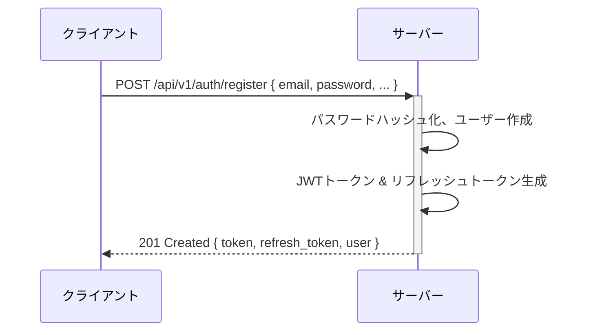
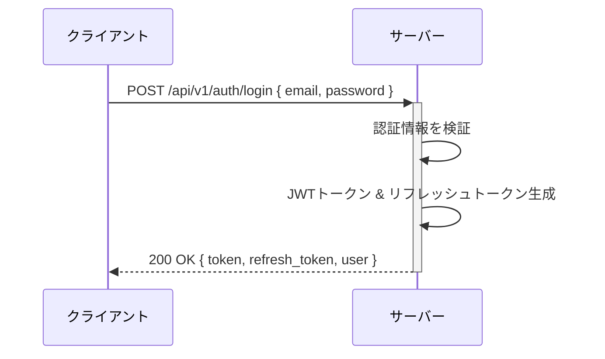
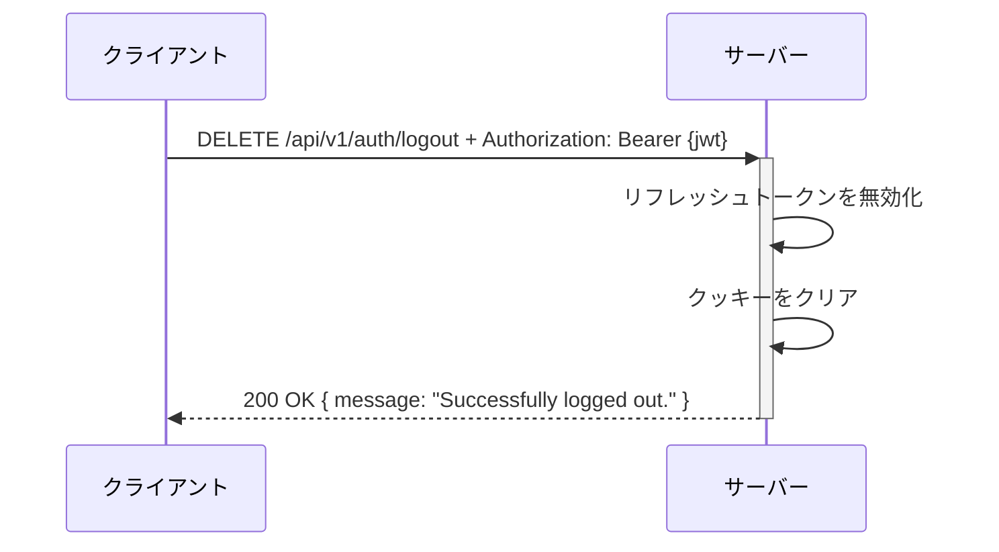

# Eventa認証システム設計

**ステータス**: Active  
**バージョン**: 2.0  
**最終更新日**: 2025-05-04  
**作成者**: Security Team

## 変更履歴

| バージョン | 日付 | 変更内容 |
|-----------|------|---------|
| 1.0 | 2025-03-01 | 初期バージョン - 基本認証設計 |
| 2.0 | 2025-05-04 | JWTとリフレッシュトークンの詳細仕様追加、セキュリティ強化策の追加 |

## 目次

1. [概要](#概要)
2. [認証フロー](#認証フロー)
3. [JWT仕様](#jwt仕様)
4. [リフレッシュトークン仕様](#リフレッシュトークン仕様)
5. [セキュリティ考慮事項](#セキュリティ考慮事項)
6. [代替案と選択理由](#代替案と選択理由)
7. [将来の拡張性](#将来の拡張性)

## 概要

Eventaプラットフォームの認証システムは、JSON Web Token (JWT)とリフレッシュトークンを組み合わせたモダンで安全な認証メカニズムを採用しています。このアプローチにより、ステートレスな認証とスケーラブルなAPIアクセス制御を実現しています。

### 主要な設計目標

- **セキュリティ**: 最新のセキュリティプラクティスに準拠した堅牢な認証システム
- **スケーラビリティ**: ステートレス認証によるシステム拡張の容易さ
- **ユーザー体験**: シームレスな認証フローと長期間のセッション維持
- **マルチプラットフォーム対応**: Web, モバイル, サードパーティAPIの統一認証
- **標準準拠**: JWTやOAuth 2.0などの確立された標準への準拠

## 認証フロー

### 1. ユーザー登録



### 2. ログイン



### 3. 認証されたAPIリクエスト

```mermaid
sequenceDiagram
    クライアント->>+サーバー: API Request + Authorization: Bearer {jwt}
    サーバー->>サーバー: JWTを検証
    alt JWT有効
        サーバー->>サーバー: リクエスト処理
        サーバー-->>-クライアント: 200 OK { データ }
    else JWT無効/期限切れ
        サーバー-->>-クライアント: 401 Unauthorized
    end
```

### 4. トークンリフレッシュ

```mermaid
sequenceDiagram
    クライアント->>+サーバー: POST /api/v1/auth/refresh + リフレッシュトークン
    サーバー->>サーバー: リフレッシュトークンを検証
    alt リフレッシュトークン有効
        サーバー->>サーバー: 新しいJWTを生成
        サーバー-->>-クライアント: 200 OK { token, user }
    else リフレッシュトークン無効
        サーバー-->>-クライアント: 401 Unauthorized
    end
```

### 5. ログアウト



## JWT仕様

### 基本情報

- **署名アルゴリズム**: HMAC SHA-256 (HS256)
- **有効期限**: 24時間 (設定可能)
- **発行者 (iss)**: `eventa-api-{environment}`
- **対象者 (aud)**: `eventa-client`
- **鍵管理**: 環境に応じた異なるシークレットキー

### JWTペイロード構造

```json
{
  "sub": "user_id",         // 対象ユーザーID
  "iss": "eventa-api-prod", // 発行者
  "aud": "eventa-client",   // 対象者
  "iat": 1620000000,        // 発行時刻（UNIX時間）
  "nbf": 1620000000,        // 有効開始時刻（UNIX時間）
  "exp": 1620086400,        // 有効期限（UNIX時間）
  "jti": "unique-token-id", // JWT ID (一意の識別子)
  "user": {
    "id": 1,                // ユーザーID
    "email": "user@example.com", // ユーザーのメールアドレス
    "role": "user"          // ユーザーの役割
  }
}
```

### JWT検証ルール

1. **署名検証**: トークンが正しく署名されていることを確認
2. **有効期限チェック**: トークンが有効期限内であることを確認
3. **発行者検証**: トークンが正しい発行者によって発行されたことを確認
4. **対象者検証**: トークンが正しい対象者向けに発行されたことを確認
5. **NBF（Not Before）検証**: トークンが有効開始時刻を過ぎていることを確認

## リフレッシュトークン仕様

### 基本情報

- **形式**: JWT
- **署名アルゴリズム**: HMAC SHA-256 (HS256)
- **有効期限**: 30日 (設定可能)
- **保存場所**: HttpOnlyクッキーおよびサーバーレスポンス
- **用途**: アクセストークン（JWT）の再発行

### リフレッシュトークンペイロード構造

```json
{
  "user_id": 1,             // ユーザーID
  "session_id": "d8e8fca2dc0f896fd7cb4cb0031ba249", // セッション識別子
  "token_type": "refresh",  // トークンタイプ
  "iss": "eventa-api-prod", // 発行者
  "aud": "eventa-client",   // 対象者
  "iat": 1620000000,        // 発行時刻（UNIX時間）
  "nbf": 1620000000,        // 有効開始時刻（UNIX時間）
  "exp": 1622592000,        // 有効期限（UNIX時間）
  "jti": "unique-token-id"  // JWT ID (一意の識別子)
}
```

### リフレッシュトークン管理

リフレッシュトークンの生成、提供、検証のプロセス：

1. **生成**: ユーザー登録・ログイン時に生成
2. **提供方法**:
   - HttpOnlyクッキーを通じて（XSS対策）
   - レスポンスボディを通じて（モバイルアプリ対応）
3. **検証**:
   - 有効期限と署名の検証
   - トークンタイプの確認（"refresh"であること）
   - ユーザーの存在確認
4. **更新ポリシー**:
   - リフレッシュトークン使用時に新しいアクセストークンを発行
   - 定期的な自動更新でセッション延長

### クッキー設定

```ruby
cookies.signed[:refresh_token] = {
  value: refresh_token,
  httponly: true,
  secure: Rails.env.production?,
  same_site: :lax,
  expires: 30.days.from_now
}
```

## セキュリティ考慮事項

### 1. トークンセキュリティ

- **JWT署名**: 強力なシークレットキーによる改ざん防止
- **有効期限**: アクセストークンの短い有効期限（24時間）
- **クレーム検証**: 発行者、対象者、発行時刻などの検証
- **トークンID**: JTI（JWT ID）による一意性確保

### 2. リフレッシュトークンのセキュリティ

- **HttpOnlyクッキー**: JavaScriptからのアクセス防止
- **Secure属性**: HTTPS接続時のみの送信
- **SameSite設定**: クロスサイトリクエストフォージェリ対策
- **セッションID**: 個別セッションの識別と無効化機能

### 3. データ保護

- **パスワードハッシュ化**: bcryptによる安全なハッシュ化
- **機密情報の保護**: JWTに機密データを含めない
- **トランスポート層のセキュリティ**: 常時HTTPS通信の強制

### 4. 攻撃対策

- **XSS対策**: HttpOnlyクッキーの使用
- **CSRF対策**: トークンベースの認証とSameSiteクッキー
- **ブルートフォース対策**: レート制限と認証試行回数制限
- **リプレイ攻撃対策**: JTIと有効期限の組み合わせ

## 代替案と選択理由

### 検討した代替案

1. **セッションベース認証**
   - **メリット**: シンプルな実装、サーバー側での完全な制御
   - **デメリット**: スケーラビリティの課題、CORS問題
   - **選択しなかった理由**: マイクロサービスアーキテクチャへの将来の移行を考慮

2. **OAuth 2.0のみの実装**
   - **メリット**: 確立された標準、サードパーティ連携に最適
   - **デメリット**: オーバーヘッド、シンプルなユースケースでは複雑すぎる
   - **選択しなかった理由**: 現段階では必要以上に複雑

3. **Cookieのみの認証**
   - **メリット**: シンプル、多くのフレームワークで標準サポート
   - **デメリット**: モバイルアプリやクロスドメイン問題
   - **選択しなかった理由**: マルチプラットフォーム要件に適合しない

### 選択した理由（JWT + リフレッシュトークン）

- スケーラブルなステートレス認証（JWTの利点）
- セッション維持とセキュリティのバランス（リフレッシュトークン）
- マルチプラットフォーム対応の容易さ
- 将来のマイクロサービスアーキテクチャとの互換性
- 業界標準のセキュリティプラクティスへの準拠

## 将来の拡張性

将来的に検討・実装予定の拡張機能：

1. **マルチデバイスセッション管理**
   - アクティブなセッションの一覧表示
   - 個別セッションのログアウト機能
   - デバイス情報の記録と表示

2. **多要素認証（MFA）**
   - TOTP（時間ベースのワンタイムパスワード）
   - SMSまたはメールによる確認コード
   - WebAuthnによる生体認証

3. **OAuth 2.0/OpenID Connect統合**
   - ソーシャルログイン（Google、Facebook、Appleなど）
   - サードパーティアプリケーション連携
   - スコープベースの権限管理

4. **高度なセキュリティ機能**
   - デバイスフィンガープリントによるリスク評価
   - 地理的異常検出
   - リアルタイムセキュリティ監視・警告システム

5. **クロスプラットフォームのシングルサインオン（SSO）**
   - Webアプリケーション、モバイルアプリ間の統合認証
   - サービス間のシームレスなユーザー体験 